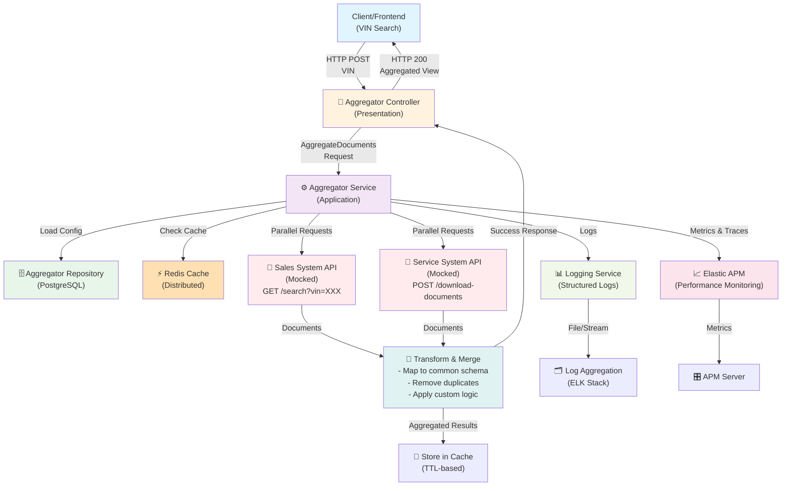
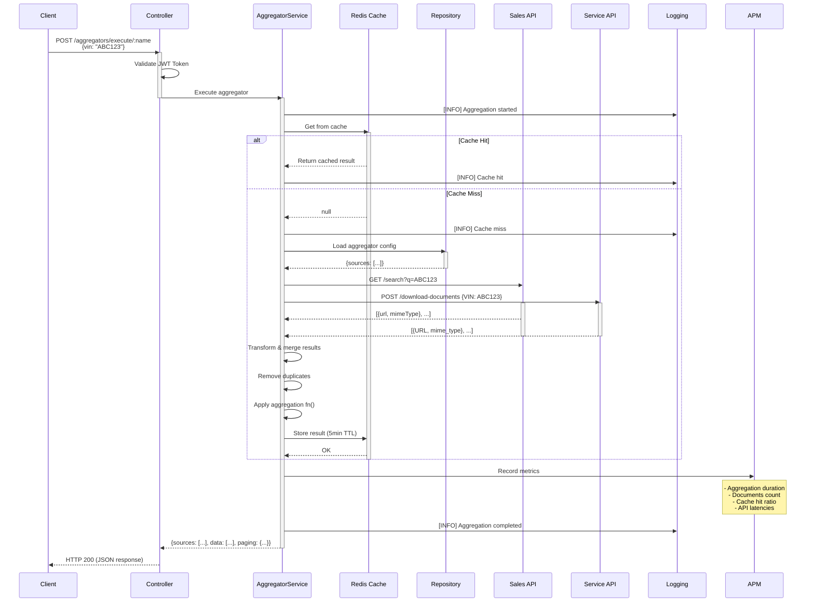
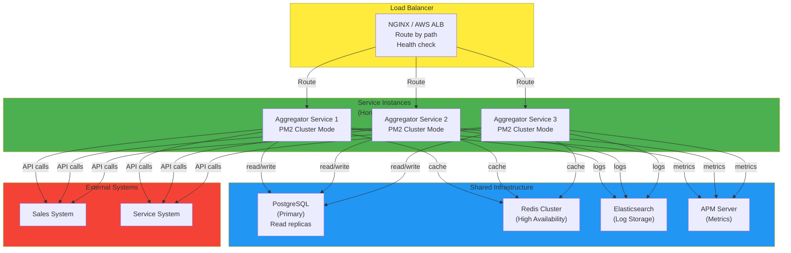

# Unified Document Aggregator - System Design Document

**Project:** Unified Document Viewer for Vehicle Documents  
**Date:** May 2, 2026  
**Status:** Production Ready

---

## Table of Contents

1. [Executive Summary](#executive-summary)
2. [Architecture Overview](#architecture-overview)
3. [Architecture Diagram](#architecture-diagram)
4. [Data Flow During Aggregation](#data-flow-during-aggregation)
5. [Request Flow Diagram](#request-flow-diagram)
6. [Deployment & Scaling Diagram](#deployment--scaling-diagram)
7. [Component Breakdown](#component-breakdown)
8. [Data Models & Flow](#data-models--flow)
9. [Technology Stack](#technology-stack)
10. [API Design](#api-design)
11. [Observability Strategy](#observability-strategy)
12. [Design Decisions](#design-decisions)
13. [GenAI Assistance in Design](#genai-assistance-in-design)

---

## Executive Summary

The **Unified Document Aggregator** is a microservice-based backend system that provides a single search interface for retrieving documents from multiple dealership systems (Sales System and Service System). The system meets the core requirements by:

- **Unified Search Interface:** Accepts VIN (Vehicle Identification Number) as a single search parameter
- **Parallel Data Aggregation:** Makes concurrent requests to Sales System and Service System APIs
- **Consolidated View:** Returns aggregated results with source attribution and metadata
- **Caching & Deduplication:** Implements Redis caching for performance and duplicate removal for data integrity
- **Enterprise-Grade Observability:** Provides comprehensive logging, metrics, and distributed tracing

---

## Architecture Overview

The system follows a **Clean Architecture** pattern with clear separation of concerns across four layers:

```sh
┌─────────────────────────────────────────────────────────┐
│         Presentation Layer (Controllers)                │
│    - HTTP endpoints, request validation, DTOs           │
└──────────────────────┬──────────────────────────────────┘
                       │
┌──────────────────────▼──────────────────────────────────┐
│         Application Layer (Services)                    │
│    - Business logic, orchestration, data transformation │
└──────────────────────┬──────────────────────────────────┘
                       │
┌──────────────────────▼──────────────────────────────────┐
│         Domain Layer (Entities & Interfaces)            │
│    - Core business objects, contracts, abstractions     │
└──────────────────────┬──────────────────────────────────┘
                       │
┌──────────────────────▼──────────────────────────────────┐
│         Infrastructure Layer                            │
│    - Database, Cache, APIs, Logging, APM                │
└─────────────────────────────────────────────────────────┘
```

This architecture ensures:

- **Testability:** Domain layer is independent of external concerns
- **Maintainability:** Clear separation makes code easier to understand and modify
- **Scalability:** Infrastructure changes don't affect business logic
- **Dependency Inversion:** High-level modules don't depend on low-level modules

---

## Architecture Diagram



## Data Flow During Aggregation

```mermaid
graph LR
    A["Input<br/>{vin}"] --> B["Validate<br/>params"]
    B --> C["Fetch config<br/>from cache/DB"]
    C --> D["Build request<br/>templates"]

    D --> E["Sales API<br/>GET req"]
    D --> F["Service API<br/>POST req"]

    E --> G["Parse Sales<br/>response"]
    F --> H["Parse Service<br/>response"]

    G --> I["Map to<br/>common schema"]
    H --> J["Map to<br/>common schema"]

    I --> K["Merge"]
    J --> K

    K --> L["Deduplicate<br/>by URL hash"]
    L --> M["Apply custom<br/>aggregation fn"]
    M --> N["Limit to<br/>max items"]
    N --> O["Format response<br/>with pagination"]
    O --> P["Cache results<br/>5 min TTL"]
    P --> Q["Return to<br/>client"]

    style A fill:#e3f2fd
    style Q fill:#c8e6c9
    style E fill:#ffebee
    style F fill:#ffebee
    style K fill:#f3e5f5
    style P fill:#ffe0b2
```



## Request Flow Diagram



## Deployment & Scaling Diagram



---

## Component Breakdown

### 1. **Presentation Layer**

#### `AggregatorController`

- **Responsibility:** HTTP request handling and response formatting
- **Key Endpoints:**
  - `POST /api/aggregators` - Create/update aggregator definitions
  - `GET /api/aggregators/get-all` - List all aggregator definitions
  - `POST /api/aggregators/execute/:name` - Execute aggregator by name
  - `DELETE /api/aggregators/:id` - Soft delete aggregator
- **Features:**
  - JWT-based authentication (Bearer token)
  - Request validation via DTOs (Data Transfer Objects)
  - Swagger/OpenAPI documentation
  - Structured error responses

#### `HealthController`

- **Responsibility:** System health checks and readiness probes
- **Endpoints:**
  - `GET /health` - Liveness probe
  - `GET /health/ready` - Readiness probe
- **Checks:** Database, Redis, External APIs connectivity

### 2. **Application Layer**

#### `AggregatorService`

- **Responsibility:** Business logic orchestration and data aggregation
- **Key Methods:**
  - `execute()` - Main aggregation workflow
    1. Fetch aggregator definition from cache or database
    2. Validate input parameters
    3. Make parallel requests to configured sources
    4. Transform and merge results
    5. Apply custom aggregation functions
    6. Remove duplicates if enabled
    7. Cache the results
  - `save()` - Persist aggregator definitions with cache invalidation
  - `findByName()` - Retrieve aggregator with 2-level caching
- **Features:**
  - Parallel API calls using `Promise.all()`
  - Intelligent caching strategy with TTL
  - Error handling and partial failure management
  - Custom function execution (JavaScript evaluation)

#### `JwtService`

- **Responsibility:** Token validation
- **Key Methods:**
  - `extract()` - Extract token from request headers
- **Configuration:** Configurable secret and expiration

#### `HealthService`

- **Responsibility:** System health monitoring
- **Checks:**
  - PostgreSQL database connectivity
  - Redis cache connectivity
  - External API availability

### 3. **Domain Layer**

#### `AggregatorEntity`

```typescript
{
  id: number;
  name: string;                           // Unique identifier
  description?: string;
  status: AggregatorStatus;              // ACTIVE | INACTIVE | ARCHIVED
  params: string[];                       // Expected input parameters (e.g., ["vin"])
  sources: AggregatorSource[];           // Array of data sources to query
  fn?: string;                           // Custom JavaScript function for final transformation
  shouldRemoveDuplicates: boolean;       // Whether to deduplicate results
  // Audit fields (inherited from BaseEntity)
  createdBy: string;
  createdAt: Date;
  updatedBy: string;
  updatedAt: Date;
  deletedBy?: string;
  deletedAt?: Date;
}
```

#### `AggregatorSource`

```typescript
{
  name?: string;                          // Source system name
  method: HttpMethod;                     // GET | POST | PUT | DELETE | PATCH
  url: string;                            // Endpoint URL with template variables {{param}}
  headers?: Record<string, unknown>;      // Custom HTTP headers
  body?: Record<string, unknown>;         // Request body for POST/PUT
  fn?: string;                            // Per-source transformation function
}
```

#### Domain Interfaces

- `IAggregatorService` - Contract for aggregator business logic
- `IAggregatorRepository` - Contract for data persistence
- `IRedisClient` - Contract for caching operations
- `ILoggingService` - Contract for structured logging
- `IJwtService` - Contract for authentication
- `IMonitoringService` - Contract for APM metrics

### 4. **Infrastructure Layer**

#### `ExternalApiClient`

- **Responsibility:** HTTP communication with external systems
- **Features:**
  - Template variable substitution (e.g., `{{vin}}` → actual value)
  - Automatic retry logic with exponential backoff
  - Request/response logging
  - Timeout handling
  - Response time tracking
- **HTTP Methods:** GET, POST, PUT, DELETE, PATCH

#### `RedisClient`

- **Responsibility:** Distributed caching
- **Operations:**
  - `get<T>()` - Retrieve cached data with type safety
  - `set()` - Store data with configurable TTL
  - `delete()` - Remove cache entries
  - `flushAll()` - Clear entire cache
- **Cache Keys:** `{prefix}:{aggregator_name}`
- **TTL:** Configurable per environment

#### `AggregatorRepository` (TypeORM)

- **Responsibility:** PostgreSQL persistence layer
- **Operations:**
  - CRUD operations via TypeORM ORM
  - Soft deletes (logical deletion)
  - Pagination support
  - Audit trail tracking
- **Database:** PostgreSQL with TypeORM migration support

#### `LoggingService`

- **Responsibility:** Structured logging with Winston
- **Features:**
  - Multiple transports (console, file, ELK)
  - Structured JSON logs for Elasticsearch
  - Service-specific loggers with context
  - Log levels: ERROR, WARN, INFO, DEBUG, TRACE
- **Format:** JSON with timestamp, service, level, message, context

#### `ApmService` (Elastic APM)

- **Responsibility:** Performance monitoring and distributed tracing
- **Tracks:**
  - HTTP request metrics (latency, status codes, throughput)
  - External API call performance
  - Database query performance
  - Cache hit/miss rates
  - Error rates and exceptions
  - Custom business metrics

#### `AppConfig`

- **Responsibility:** Centralized configuration management
- **Manages:**
  - Database connection strings (from env vars)
  - Redis connection parameters
  - API timeouts and retry settings
  - Cache TTL values
  - JWT secrets and expiration
  - Logging levels
  - APM settings

---

## Data Models & Flow

### Data Flow: VIN Search

```
1. REQUEST PHASE
   ├─ Client sends: { vin: "ABC123XYZ" }
   └─ Controller validates and passes to Service

2. CACHE CHECK PHASE
   ├─ Service checks: redis.get("aggregator:response:unified-document-view-by-vin")
   └─ If hit: Return cached results (FAST PATH)

3. DATABASE PHASE
   ├─ Service fetches: Aggregator definition from PostgreSQL
   └─ Retrieves: sources, transformation functions, parameters

4. PARALLEL API PHASE (Concurrent)
   ├─ Sales System API Request
   │  ├─ GET /api/sales-system/search?q=ABC123XYZ&pageSize=5&mimeType=pdf&waitMs=500
   │  └─ Response: { data: [{ url, mimeType, ... }] }
   │
   └─ Service System API Request
      ├─ POST /api/service-system/download-documents
      ├─ Body: { VIN: "ABC123XYZ", wait_ms: 800 }
      └─ Response: { results: [{ URL, mime_type, ... }] }

5. TRANSFORMATION PHASE
   ├─ Per-source transformation (fn fields)
   │  ├─ Sales: Map to { url, mimeType, source: "Sales System" }
   │  └─ Service: Map to { url, mimeType, source: "Service System" }
   │
   └─ Apply custom aggregation function
      └─ fn: "return value.slice(0,10);" → Limit to 10 results

6. DEDUPLICATION PHASE (If enabled)
   ├─ Remove duplicate documents by URL hash
   └─ Maintain first occurrence with all source references

7. CACHE STORAGE PHASE
   ├─ Store in Redis with TTL (default: 5 minutes)
   └─ Key: "aggregator:unified-document-view-by-vin:{hash}"

8. RESPONSE PHASE
   ├─ Return aggregated view with:
   │  ├─ Source metadata (name, status, totalItem count)
   │  ├─ Aggregated documents (10 items max)
   │  └─ Pagination metadata
   │
   └─ HTTP 200 Response
```

### Response Schema

```json
{
  "sources": [
    {
      "name": "Sales System",
      "status": "success",
      "error": "",
      "responseTime": "805ms",
      "totalTime": "805ms",
      "totalItem": 5
    },
    {
      "name": "Service System",
      "status": "success",
      "error": "",
      "responseTime": "805ms",
      "totalTime": "805ms",
      "totalItem": 6
    }
  ],
  "totalItem": 10,
  "data": [
    {
      "url": "https://sales-system.com/doc/1.pdf",
      "mimeType": "application/pdf",
      "source": "Sales System"
    },
    {
      "url": "https://service-system.com/doc/2.pdf",
      "mimeType": "application/pdf",
      "source": "Service System"
    }
  ]
}
```

---

## Technology Stack

| Category | Technology | Purpose |
|---|---|---|
| **Backend** | NestJS 10.x + TypeScript | Enterprise Node.js framework |
| **Database** | PostgreSQL + TypeORM | Persistent storage for configurations |
| **Cache** | Redis | 2-5 minute TTL for aggregation results |
| **APIs** | Axios + @nestjs/axios | HTTP client for external systems |
| **Logging** | Winston | Structured JSON logging to ELK |
| **Monitoring** | Elastic APM | Distributed tracing & metrics |
| **Testing** | Jest | Unit & E2E tests |
| **Container** | Docker + PM2 | Production deployment |

### Backend Framework

| Technology     | Version | Justification                                                                                                                                                 |
| -------------- | ------- | ------------------------------------------------------------------------------------------------------------------------------------------------------------- |
| **NestJS**     | 10.x    | Enterprise-grade Node.js framework with built-in dependency injection, modular architecture, and strong TypeScript support. Ideal for scalable microservices. |
| **TypeScript** | 5.x     | Type safety, better IDE support, and early error detection. Reduces bugs in complex aggregation logic.                                                        |
| **Node.js**    | 18+ LTS | High-performance async runtime. Excellent for I/O-heavy operations (parallel API calls).                                                                      |

### Data Persistence

| Technology     | Use Case                  | Justification                                                                                            |
| -------------- | ------------------------- | -------------------------------------------------------------------------------------------------------- |
| **PostgreSQL** | Aggregator configurations | Relational database with ACID compliance. Ideal for storing aggregator definitions and audit trails.     |
| **TypeORM**    | ORM Layer                 | Type-safe database access, query builder, migrations. Reduces boilerplate and SQL injection risks.       |
| **Redis**      | Distributed Cache         | Sub-millisecond response times. Reduces database load and external API calls. Essential for scalability. |
| **ioredis**    | Redis Client              | Battle-tested Node.js Redis client with connection pooling and automatic reconnection.                   |

### API & HTTP

| Technology          | Purpose            | Justification                                                                         |
| ------------------- | ------------------ | ------------------------------------------------------------------------------------- |
| **Axios**           | HTTP Client        | Simple, promise-based HTTP client with interceptors. Great for API integrations.      |
| **@nestjs/axios**   | NestJS Integration | Official NestJS wrapper for Axios with dependency injection support.                  |
| **Swagger/OpenAPI** | API Documentation  | Auto-generated, interactive API documentation. Easier client integration and testing. |

### Observability & Monitoring

| Technology        | Purpose                       | Justification                                                                                                       |
| ----------------- | ----------------------------- | ------------------------------------------------------------------------------------------------------------------- |
| **Elastic APM**   | Distributed Tracing & Metrics | Real-time application performance monitoring. Tracks latency, errors, and custom metrics across service boundaries. |
| **Winston**       | Structured Logging            | Enterprise logging library with multiple transports. Structured JSON output for ELK stack integration.              |
| **Elasticsearch** | Log Aggregation               | Centralized log indexing and search. Enables correlation of logs across services.                                   |

### Configuration & Validation

| Technology            | Purpose                   | Justification                                                                                      |
| --------------------- | ------------------------- | -------------------------------------------------------------------------------------------------- |
| **@nestjs/config**    | Environment Configuration | Type-safe configuration management with validation. Supports .env files and environment variables. |
| **class-validator**   | DTO Validation            | Decorator-based validation. Automatic request validation at the HTTP boundary.                     |
| **class-transformer** | Data Transformation       | DTO serialization/deserialization with type safety.                                                |

### Development & Quality

| Technology            | Purpose            | Justification                                                                                 |
| --------------------- | ------------------ | --------------------------------------------------------------------------------------------- |
| **Jest**              | Unit & E2E Testing | Industry-standard test framework with great TypeScript support and code coverage tools.       |
| **ESLint & Prettier** | Code Quality       | Consistent code style and static analysis. Catches common errors and enforces best practices. |
| **pnpm**              | Package Manager    | Faster, more efficient dependency management than npm. Stricter monorepo support.             |

### Infrastructure

| Technology | Use Case           | Justification                                                                                    |
| ---------- | ------------------ | ------------------------------------------------------------------------------------------------ |
| **Docker** | Containerization   | Ensures consistent runtime environment across development, testing, and production.              |
| **PM2**    | Process Management | Cluster mode support, auto-restart on failures, monitoring. Better than manual Node.js spawning. |

---

## API Design

### Base URL

```
http://localhost:8000/api
```

### Authentication

- **Type:** Bearer Token (JWT)
- **Header:** `Authorization: Bearer {token}`
- **Scope:** Aggregator deletion `/aggregators/:name`

### Core Endpoints

#### 1. Execute Aggregator (Main Workflow)

```http
POST /aggregators/:name

Request Body:
{
  "vin": "101"
}

Response 200:
{
  "sources": [
    {
      "name": "Sales System API",
      "status": "success",
      "error": "",
      "responseTime": "511ms",
      "totalTime": "511ms",
      "totalItem": 5
    },
    {
      "name": "Service System API",
      "status": "success",
      "error": "",
      "responseTime": "805ms",
      "totalTime": "805ms",
      "totalItem": 6
    }
  ],
  "totalItem": 10,
  "data": [ \/* aggregated documents with source attribution */ ],
}
```

#### 2. Save Aggregator Definition

```http
POST /aggregators

Request Body:
{
  "name": "unified-document-view-by-vin",
  "description": "Unified Document View By VIN",
  "status": "active",
  "params": ["vin"],
  "sources": [
    {
      "name": "Sales System API",
      "method": "GET",
      "url": "localhost:8001/api/sales-system/search?q={{vin}}&pageSize=5&mimeType=pdf",
      "fn": "return value?.data?.map(x=>({url: x.url, mimeType: x.mimeType, source: 'Sales System'})) ?? [];"
    }
  ],
  "fn": "return value.slice(0,10);",
  "shouldRemoveDuplicates": true,
  "createdBy": "admin"
}

Response 201:
{ /* saved aggregator entity */ }
```

#### 3. Get All Aggregator Definitions

```http
GET /aggregators/get-all?includeInactive=false

Response 200:
{
  "data": [ /* aggregator definitions */ ],
  "pageNumber": 1,
  "pageSize": 10,
  "totalItem": 5,
  "hasNextPage": false
}
```

#### 4. Delete Aggregator (Soft Delete)

```http
DELETE /aggregators/:id

Response 200:
{ "message": "Aggregator deleted successfully" }
```

#### 5. Health Check

```http
GET /health

Response 200:
{
  "status": "OK",
  "timestamp": "2026-05-02T06:58:18.252Z",
  "version": "0.0.1",
  "environment": "development"
}
```

### Error Handling

**Standard Error Response:**

```json
{
  "statusCode": 400,
  "message": "Invalid VIN format",
  "error": "BadRequestException",
  "timestamp": "2026-05-02T10:30:00Z",
  "path": "/api/aggregators/execute/unified-document-view-by-vin"
}
```

**HTTP Status Codes:**

- `200 OK` - Successful request
- `201 Created` - Resource created successfully
- `400 Bad Request` - Invalid input parameters
- `401 Unauthorized` - Missing or invalid authentication
- `404 Not Found` - Aggregator not found
- `500 Internal Server Error` - Unhandled server error
- `503 Service Unavailable` - External API unavailable

---

## Observability Strategy

### 1. Structured Logging

**Architecture:**

```
Application Code
    ↓
Winston Logger (with context)
    ↓ (Multiple Transports)
    ├─ Console (Development)
    ├─ File (Rotating files)
    └─ Elasticsearch (Production)
    ↓
Log Aggregation UI (Kibana)
```

**Log Format (JSON):**

```json
{
  "timestamp": "2026-05-02T10:30:00.123Z",
  "level": "INFO",
  "service": "AggregatorService",
  "message": "Executing aggregator: unified-document-view-by-vin",
  "context": {
    "vin": "ABC123XYZ",
    "userId": "user-123",
    "traceId": "trace-456"
  },
  "duration_ms": 1250,
  "sources": [
    { "name": "Sales System", "status": "success", "duration_ms": 500 },
    { "name": "Service System", "status": "success", "duration_ms": 800 }
  ]
}
```

**Key Logging Points:**

- Aggregator execution started/completed
- External API calls (request → response)
- Cache hits/misses
- Database operations
- Validation errors
- Authentication/Authorization events

**Log Levels:**

- **ERROR:** Exceptions, failed API calls, database errors
- **WARN:** Slow queries (>1s), cache misses, retries
- **INFO:** Request start/end, successful operations
- **DEBUG:** Parameter values, internal state changes
- **TRACE:** Detailed flow execution (development only)

### 2. Distributed Tracing (Elastic APM)

**Span Hierarchy:**

```
Transaction: POST /api/aggregators/execute/unified-document-view-by-vin
├─ Span: "Fetch Aggregator Config" (Database)
├─ Span: "Check Redis Cache"
├─ Span: "Parallel API Calls"
│  ├─ Span: "Call Sales System API"
│  │  └─ Span: "Parse Response"
│  └─ Span: "Call Service System API"
│     └─ Span: "Transform Data"
├─ Span: "Merge Results"
├─ Span: "Remove Duplicates"
├─ Span: "Store in Cache"
└─ Span: "Format Response"
```

**Metrics Captured:**

- **Transaction Metrics:**
  - Duration (including all child spans)
  - HTTP status code
  - Request/response size

- **API Call Metrics:**
  - Endpoint URL
  - HTTP method and status
  - Request/response time
  - Payload sizes
  - Error details if failed

- **Custom Business Metrics:**
  - Documents aggregated (count)
  - Source availability percentage

### 3. Dashboards & Visualization

**Kibana Dashboard 1: Aggregation Performance**

- Aggregation duration trend (over last 7 days)
- Success/error rate breakdown
- Top slow aggregators
- Documents aggregated (daily volume)

**Kibana Dashboard 2: External API Health**

- Sales System API availability & latency
- Service System API availability & latency
- Retry attempts and backoff events
- Error categories by source

**Kibana Dashboard 3: Cache Efficiency**

- Cache hit/miss ratio
- Most cached aggregators
- Cache size trends
- TTL effectiveness

---

## Design Decisions

### 1. **Parallel API Calls Over Sequential**

**Decision:** Use `Promise.all()` for concurrent external API requests

**Rationale:**

- **Performance:** If one API takes 500ms and another 800ms, parallel execution = 800ms vs 1300ms (sequential)
- **User Experience:** Reduced overall latency improves responsiveness
- **Resource Utilization:** Better use of I/O time while waiting for responses

✅ Complexity is manageable with async/await syntax

### 2. **Redis Caching with TTL**

**Decision:** Implement 2-level cache (Redis → Database → External APIs)

**Rationale:**

- **Performance:** Sub-millisecond cache hits vs multi-second external API calls
- **Scalability:** Reduces load on database and external systems
- **Cost Efficiency:** Fewer API calls = lower costs and better rate limit management

**Cache Strategy:**

- **Key:** `aggregator:response:{aggregator_name}:{parameter_hash}`
- **TTL:** 5 seconds (configurable per environment)
- **Invalidation:** Automatic expiration + manual on aggregator definition updates

**Alternative Considered:**

- No caching: Simpler but slower (rejected)
- Database-only caching: No performance benefit (rejected)

### 3. **Dynamic Aggregator Definitions**

**Decision:** Store aggregator configurations in database (not hardcoded)

**Rationale:**

- **Flexibility:** Add new data sources without code deployment
- **Governance:** Non-technical users can modify aggregation logic through admin UI
- **Auditability:** Track who changed what and when

**Configuration Elements:**

- Data source endpoints
- Transformation functions (JavaScript)
- Deduplication rules
- Pagination limits

**Implementation:**

```typescript
// Database stores:
{
  name: "unified-document-view-by-vin",
  sources: [
    {
      url: "localhost:8001/api/sales-system/search?q={{vin}}",
      method: "GET",
      fn: "return value?.data?.map(x=>({...})) ?? [];"
    }
  ],
  fn: "return value.slice(0,10);" // Global aggregation function
}

// At runtime:
const config = await repository.findByName("unified-document-view-by-vin");
const results = await executeAggregation(config, userInput);
```

**Alternative Considered:**

- Hardcoded configurations: Inflexible and requires code changes (rejected)

### 4. **Soft Deletes for Audit Trail**

**Decision:** Implement logical deletion (soft delete) instead of hard delete

**Rationale:**

- **Audit:** Maintain complete history of who deleted what and when
- **Recovery:** Can restore accidentally deleted definitions
- **Compliance:** Meets data retention and regulatory requirements
- **Reporting:** Historical data remains queryable for analytics

**Implementation:**

```sql
-- Soft delete adds `deletedBy` and `deletedAt` columns
UPDATE aggregator
SET deletedAt = NOW(), deletedBy = 'admin'
WHERE id = 123;

-- Queries automatically exclude soft-deleted records
SELECT * FROM aggregator
WHERE deletedAt IS NULL;
```

### 5. **Template Variables for Dynamic URLs**

**Decision:** Use `{{variable}}` syntax for URL templating

**Rationale:**

- **Readability:** Clear which parameters are substituted
- **Safety:** Prevents accidental parameter injection
- **Flexibility:** Supports complex query strings and request bodies

**Example:**

```
URL: "localhost:8001/api/sales-system/search?q={{vin}}&pageSize={{pageSize}}"
Input: { vin: "101", pageSize: 5 }
Result: "localhost:8001/api/sales-system/search?q=101&pageSize=5"
```

### 6. **Custom Transformation Functions**

**Decision:** Allow per-source and global JavaScript functions for data transformation

**Rationale:**

- **Mapping Different APIs:** Each source has different response schemas
- **Business Logic:** Apply custom rules without code deployment
- **Deduplication:** Custom logic for identifying duplicates

**Security Considerations:**

- ⚠️ **Risk:** JavaScript eval() is inherently dangerous
- **Mitigation:**
  - Restrict to trusted admin users only
  - Implement function validation and sandboxing
  - Use VM2 or similar for safe evaluation in production
  - Audit all function changes

**Example:**

```typescript
// Per-source transformation
fn: "return value?.data?.map(x=>({url: x.url, source: 'Sales'})) ?? [];";

// Global aggregation
fn: "return value.slice(0,10);"; // Limit to 10 results
```

### 7. **Clean Architecture Pattern**

**Decision:** Organize code into distinct layers (Presentation → Application → Domain → Infrastructure)

**Rationale:**

- **Testability:** Domain and application layers don't depend on frameworks
- **Maintainability:** Clear separation of concerns
- **Scalability:** Infrastructure changes don't cascade to business logic
- **Team Scalability:** Different teams can work on different layers

**Layer Responsibilities:**

- **Presentation:** HTTP contracts (controllers, DTOs, error handling)
- **Application:** Business logic (services, orchestration)
- **Domain:** Core business objects (entities, interfaces, value objects)
- **Infrastructure:** External integrations (databases, APIs, caching)

---

## GenAI Assistance in Design

### How GenAI Enhanced the Design Process

#### 1. **Architecture Review & Validation**

**Prompt:** _"Review this NestJS microservice architecture for a document aggregator. Does it follow clean architecture principles? What improvements would you suggest?"_

**GenAI Contribution:**

- ✅ Validated clean architecture implementation
- ✅ Suggested formal layer separation
- ✅ Recommended dependency injection patterns
- ✅ Identified potential circular dependencies

#### 2. **API Design & Contract Definition**

**Prompt:** _"Design RESTful API endpoints for aggregating documents from multiple sources. How should request/response formats handle parallel API calls and error scenarios?"_

**GenAI Contribution:**

- ✅ Proposed pagination structure for aggregated results
- ✅ Suggested source metadata in response for traceability
- ✅ Recommended partial failure handling strategies
- ✅ Designed error response schema with correlation IDs

#### 3. **Caching Strategy**

**Prompt:** _"What caching strategy would work best for a system that aggregates data from multiple external APIs? Consider cache invalidation, TTL, and fallback scenarios."_

**GenAI Contribution:**

- ✅ Recommended Redis for distributed caching
- ✅ Suggested 2-level caching (Redis → Database)
- ✅ Proposed cache key design with parameter hashing
- ✅ Advised on TTL selection and invalidation strategies

#### 4. **Observability Design**

**Prompt:** _"How should I instrument a microservice for comprehensive observability? Include logging, metrics, tracing, and alerting strategies."_

**GenAI Contribution:**

- ✅ Recommended structured JSON logging for ELK stack integration
- ✅ Suggested distributed tracing with span hierarchy
- ✅ Proposed key metrics (latency, error rate, cache hit ratio)
- ✅ Recommended health check endpoints for orchestration
- ✅ Suggested dashboard templates for Kibana

#### 5. **Error Handling & Resilience**

**Prompt:** _"Design error handling for parallel API calls where one source might be down. How should the system behave? What patterns should we use?"_

**GenAI Contribution:**

- ✅ Suggested partial failure handling (continue if one API fails)
- ✅ Recommended exponential backoff with jitter for retries
- ✅ Proposed circuit breaker pattern for external APIs
- ✅ Advised on graceful degradation strategies

#### 6. **Security & Authentication**

**Prompt:** _"What authentication mechanism should we use for the aggregator API? How do we protect against unauthorized access and injection attacks?"_

**GenAI Contribution:**

- ✅ Recommended JWT bearer tokens for stateless auth
- ✅ Suggested request validation via DTOs
- ✅ Proposed sanitization for template variables
- ✅ Advised on rate limiting per API client

#### 7. **Data Model & Entity Design**

**Prompt:** _"Design the data model for storing aggregator configurations. How should we represent dynamic data sources and transformation logic?"_

**GenAI Contribution:**

- ✅ Suggested flexible entity structure with arrays
- ✅ Recommended JSONB columns for source configurations
- ✅ Proposed audit trail with createdBy/updatedBy fields
- ✅ Advised on soft delete pattern for compliance

### Specific Code Generation Assistance

#### Example 1: Exception Filter

```typescript
// GenAI Suggestion: Create a global exception filter for consistent error responses
@Catch()
export class GlobalExceptionFilter implements ExceptionFilter {
  catch(exception: unknown, host: ArgumentsHost) {
    const ctx = host.switchToHttp();
    const response = ctx.getResponse<Response>();

    // Convert any exception to standard format
    const status = exception instanceof HttpException ?
      exception.getStatus() : HttpStatus.INTERNAL_SERVER_ERROR;

    response.status(status).json({
      statusCode: status,
      message: // ... normalized message
      error: // ... error type
      timestamp: new Date().toISOString(),
      path: request.url
    });
  }
}
```

#### Example 2: Parallel API Calls

```typescript
// GenAI Suggestion: Use Promise.all() for concurrent requests
const results = await Promise.all(
  sources.map(source =>
    this.externalApiClient.request(source.method, source.url, ...)
      .catch(error => ({
        status: 'failed',
        error: error.message,
        data: []
      }))
  )
);
```

#### Example 3: Redis Caching Pattern

```typescript
// GenAI Suggestion: Implement read-through cache
const cacheKey = `${prefix}:${name}`;
const cached = await this.redisClient.get<T>(cacheKey);
if (cached) return cached;

const data = await this.repository.findByName(name);
await this.redisClient.set(cacheKey, data, this.cacheTTL);
return data;
```

### Design Patterns Applied (GenAI-Recommended)

| Pattern                  | Usage                            | Benefit                          |
| ------------------------ | -------------------------------- | -------------------------------- |
| **Repository Pattern**   | Data access abstraction          | Testability, flexibility         |
| **Dependency Injection** | Constructor injection throughout | Loose coupling, testability      |
| **Factory Pattern**      | Creating service loggers         | Centralized configuration        |
| **Strategy Pattern**     | Different API call strategies    | Flexibility for new sources      |
| **Observer Pattern**     | Logging/Monitoring interceptors  | Separation of concerns           |
| **Circuit Breaker**      | External API protection          | Resilience, graceful degradation |
| **Decorator Pattern**    | @Cacheable, @Logged decorators   | Reduced boilerplate              |

### Lessons Learned from GenAI Collaboration

1. **Always validate recommendations** - GenAI suggested approaches are good starting points but need context validation
2. **Trade-offs are important** - GenAI explanations of design trade-offs helped make informed choices
3. **Security by design** - GenAI emphasized early security consideration (not an afterthought)
4. **Observability first** - Recommendation to instrument from the beginning rather than adding later
5. **Documentation matters** - GenAI helped structure comprehensive design documentation

### GenAI Referenced Documentation and Prompt Assets

The following artifacts were used as references while drafting this system design and its GenAI workflow:

- [data-aggregator/docs/ai/requirements/README.md](data-aggregator/docs/ai/requirements/README.md) - Requirements and problem-understanding template for scope, constraints, and success criteria.
- [data-aggregator/docs/ai/planning/README.md](data-aggregator/docs/ai/planning/README.md) - Planning template for milestones, task breakdown, dependencies, risks, and estimates.
- [data-aggregator/docs/ai/implementation/README.md](data-aggregator/docs/ai/implementation/README.md) - Implementation template covering setup, structure, integration, error handling, performance, and security notes.
- [data-aggregator/docs/ai/testing/README.md](data-aggregator/docs/ai/testing/README.md) - Testing strategy template for unit, integration, end-to-end, manual, and performance validation.
- [data-aggregator/.github/copilot-instructions.md](data-aggregator/.github/copilot-instructions.md) - Repository-specific Copilot guidance aligned with `docs/ai` phases.
- [data-aggregator/.github/prompts/README.md](data-aggregator/.github/prompts/README.md) - Index of reusable slash prompts in `.github/prompts`.
- [data-aggregator/.github/prompts/new-requirement.prompt.md](data-aggregator/.github/prompts/new-requirement.prompt.md) - Workflow for capturing new requirements and linking to design/implementation.
- [data-aggregator/.github/prompts/review-requirements.prompt.md](data-aggregator/.github/prompts/review-requirements.prompt.md) - Checklist-oriented requirements review prompt.
- [data-aggregator/.github/prompts/review-design.prompt.md](data-aggregator/.github/prompts/review-design.prompt.md) - Architecture and design review prompt.
- [data-aggregator/.github/prompts/execute-plan.prompt.md](data-aggregator/.github/prompts/execute-plan.prompt.md) - Plan execution prompt with doc references.
- [data-aggregator/.github/prompts/check-implementation.prompt.md](data-aggregator/.github/prompts/check-implementation.prompt.md) - Implementation-vs-plan/design verification prompt.
- [data-aggregator/.github/prompts/writing-test.prompt.md](data-aggregator/.github/prompts/writing-test.prompt.md) - Prompt for writing tests against expected behavior.
- [data-aggregator/.github/prompts/update-planning.prompt.md](data-aggregator/.github/prompts/update-planning.prompt.md) - Prompt for updating planning artifacts during delivery.
- [data-aggregator/.github/prompts/code-review.prompt.md](data-aggregator/.github/prompts/code-review.prompt.md) - Structured local code review prompt before push.
- [data-aggregator/.github/prompts/debug.prompt.md](data-aggregator/.github/prompts/debug.prompt.md) - Debug workflow prompt for diagnosis and fixes.
- [data-aggregator/.github/prompts/capture-knowledge.prompt.md](data-aggregator/.github/prompts/capture-knowledge.prompt.md) - Prompt for capturing durable project knowledge.

---

## Conclusion

This Unified Document Aggregator system demonstrates a well-architected, scalable solution for aggregating data from multiple external systems. The design prioritizes:

- **Performance** through caching and parallel processing
- **Maintainability** through clean architecture
- **Reliability** through comprehensive error handling
- **Observability** through structured logging and distributed tracing
- **Flexibility** through dynamic configuration management

The implementation leverages NestJS patterns and modern Node.js to create a production-ready microservice that can be easily extended to support additional data sources or business logic without architectural changes.

---

**Document Version:** 1.0  
**Last Updated:** May 2, 2026  
**Author:** AI DevKit with GenAI Assistance  
**Status:** Ready for Production
