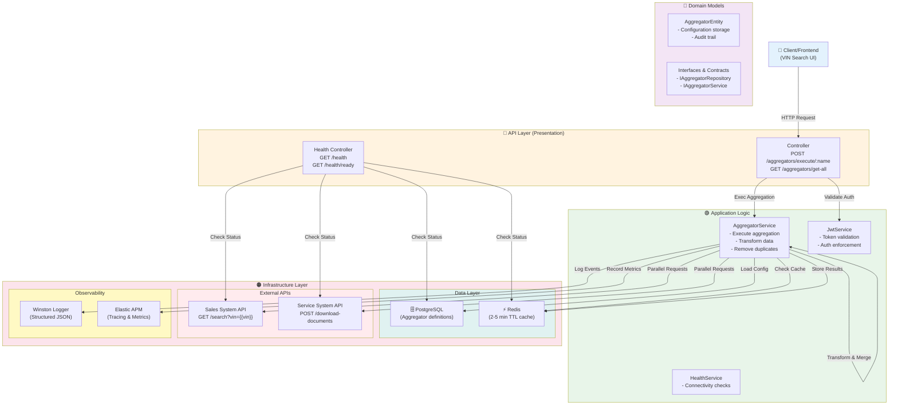
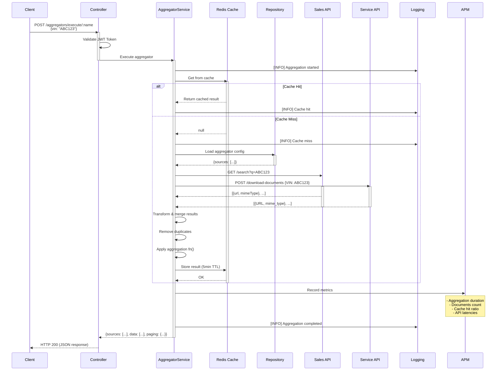
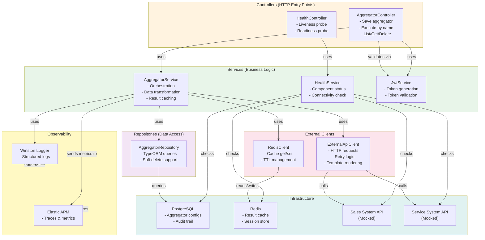
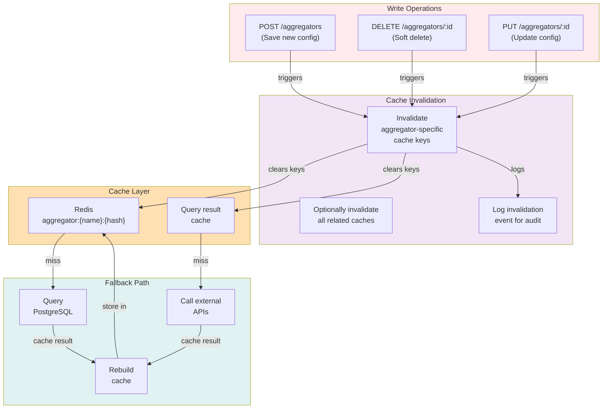
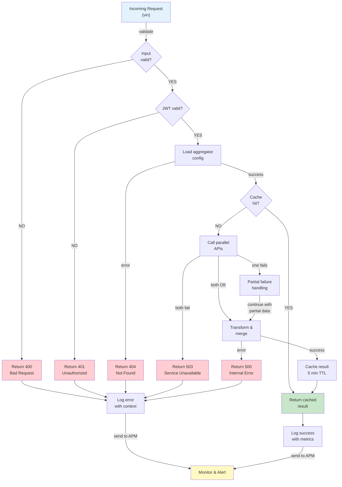
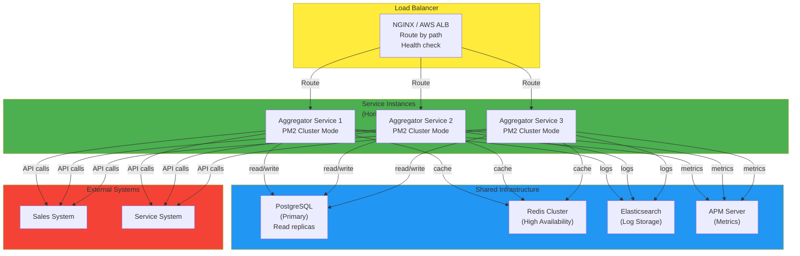

# Architecture Diagrams

## High-Level System Architecture

## Request Flow Diagram

## Data Flow During Aggregation

```mermaid
graph LR
    A["Input<br/>{vin}"] --> B["Validate<br/>params"]
    B --> C["Fetch config<br/>from cache/DB"]
    C --> D["Build request<br/>templates"]
    
    D --> E["Sales API<br/>GET req"]
    D --> F["Service API<br/>POST req"]
    
    E --> G["Parse Sales<br/>response"]
    F --> H["Parse Service<br/>response"]
    
    G --> I["Map to<br/>common schema"]
    H --> J["Map to<br/>common schema"]
    
    I --> K["Merge"]
    J --> K
    
    K --> L["Deduplicate<br/>by URL hash"]
    L --> M["Apply custom<br/>aggregation fn"]
    M --> N["Limit to<br/>max items"]
    N --> O["Format response<br/>with pagination"]
    O --> P["Cache results<br/>5 min TTL"]
    P --> Q["Return to<br/>client"]
    
    style A fill:#e3f2fd
    style Q fill:#c8e6c9
    style E fill:#ffebee
    style F fill:#ffebee
    style K fill:#f3e5f5
    style P fill:#ffe0b2
```

## Component Interaction Diagram

## Cache Invalidation Strategy

## Error Handling & Resilience Flow

## Deployment & Scaling Diagram

